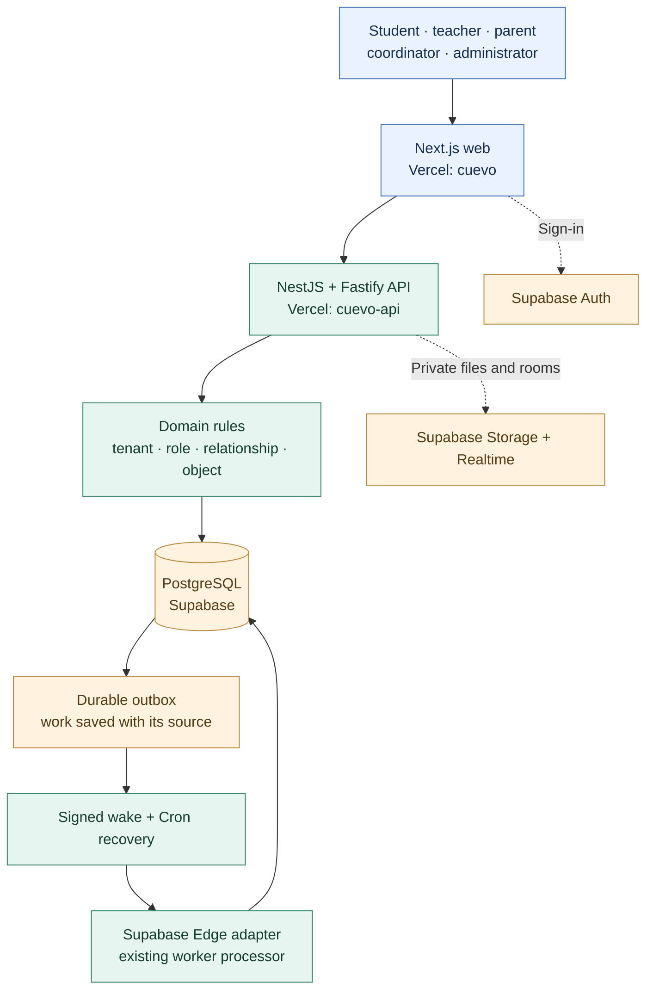
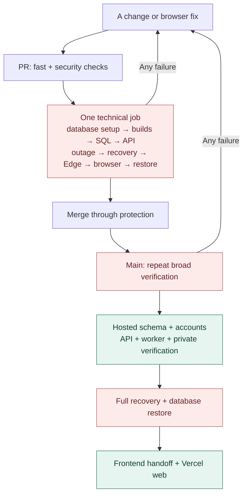
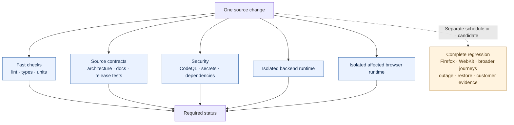
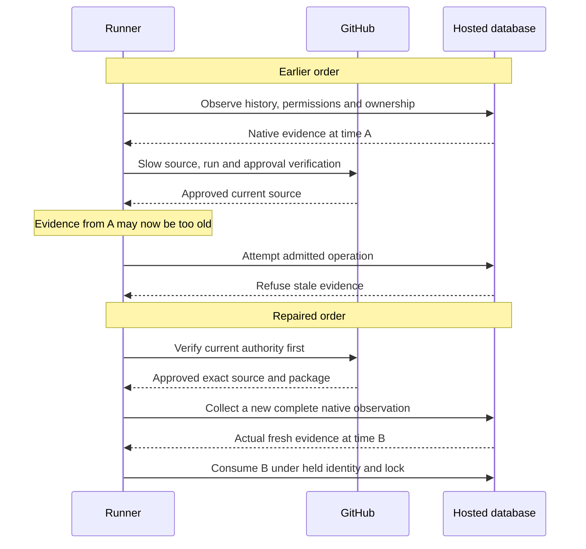
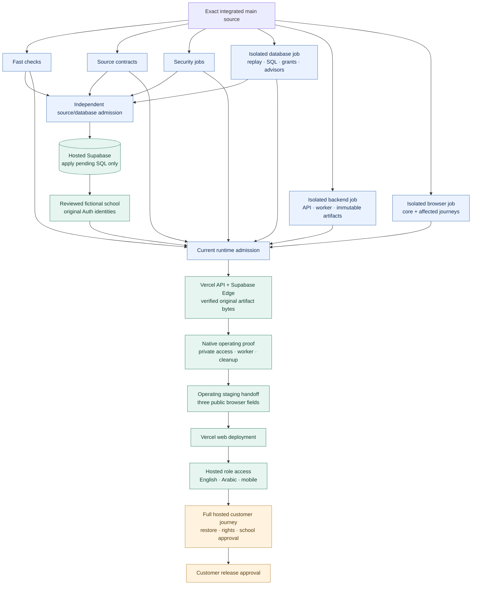
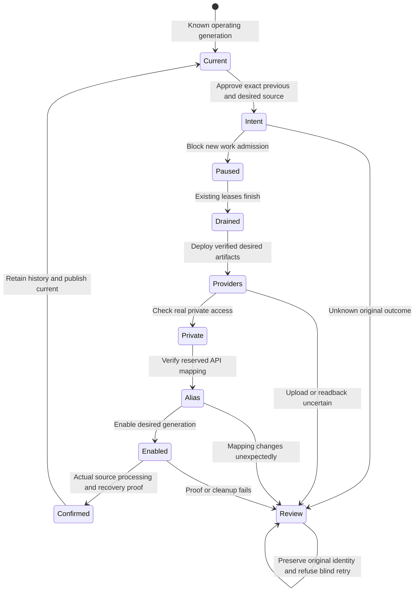

# Cuevo: how our release process evolved

**A practical learning guide for a junior developer · 8 October 2026**

> The application architecture and the release process are different systems. Cuevo's application foundation is sensible. Its release process became too tightly connected, then accumulated custom recovery and evidence machinery before the first hosted app was delivered. The current repairs separate those responsibilities. They still require independent review, protected integration and actual hosted verification.

This guide explains the code we have, why it became slow, what changed and what a small experienced team would usually do. It is a dated teaching document, not a product specification, release approval or claim that customers can use the app. The [original learning guide](cuevo-release-learning-guide.md) contains more detail about authorization, idempotency and the earlier incident.

## 1. Start with the two maps

### The application: what happens when somebody uses Cuevo

The API checks access before a protected action. The database preserves grants, row policies and private domain functions. An important saved action commits its source, audit and outbox together. The worker processes that durable work; a wake is a delivery hint, not permission to award grades or grant access.

This is a **modular monolith with separate web, API and worker applications**. We have clear code owners and deployable outputs while keeping domain authority together. Splitting the product into many business microservices would add network, deployment and recovery problems without evidence that we need them.

### The release process: what happens when a developer changes code

Next.js, NestJS, Supabase and Vercel do **not** require us to run the whole customer acceptance suite twice before installing a staging database. That was a repository policy choice. Tests establish confidence in source; deployment performs an external action; hosted tests check the actual result. None automatically substitutes for another.

## 2. The old process: one large gate before almost everything

The [2 October release decision](../decisions/2026-10-02-ci-cd-and-release-boundaries.md) records one exclusive technical job with a 90-minute budget. The [5 October amendment](../decisions/2026-10-05-ci-gated-vercel-release.md) required the full PR checks and then the canonical main checks before release admission. The intention was to protect a consequential school application. The sequencing made useful staging milestones wait for expensive unrelated work.

A small frontend defect could send us through database setup, integration, worker and browser work again. Even when those tests passed locally, they created **temporary databases**. They did not install tables in the hosted Supabase project.

The backend handoff also required full recovery and restore evidence before the frontend could connect. Those are valuable customer gates. Making them prerequisites for the first private synthetic staging app made database installation and basic hosted feedback unnecessarily difficult.

### What “technical MVP” was testing

| Work | What it proves | What it does not prove |
| --- | --- | --- |
| Disposable database bootstrap | Reviewed migrations and fictional fixtures can be installed in a test environment | Hosted Supabase has been provisioned |
| Production builds and packaging | Web, API and worker outputs compile in the selected format | Those outputs have been deployed |
| SQL, grants and row policy tests | Required access and denial rules behave in the test database | Current hosted provider permissions match |
| API integration | Authorized domain actions, scope and original-key retries work | Every real hosted network/configuration path works |
| Outage, recovery and signed worker tests | Tested failures preserve durable work and recover through the chosen adapter | Hosted worker secrets, Cron and provider transport are correct |
| Browser journeys | The tested roles, languages, viewports and interactions behave correctly | The whole product has customer acceptance |
| Restoration and source freeze | Owned synthetic fixtures are restored and tested source did not change | A managed-provider disaster restore or customer launch is approved |

The problem was not that these tests were worthless. The problem was **which questions had to be answered before each next action**, and how often the same work ran.

## 3. The first repairs: faster ownership and safer evidence

The founder asked on 7 October to fix the architecture before continuing provisioning. The [verification profiles decision](../decisions/2026-10-07-verification-profiles.md) separated routine work from full regression and customer candidates. It retained required PR/main checks and the relevant security tests.

Independent jobs can run at the same time. Each runtime job owns its own Docker environment. Sharing one mutable test database between parallel jobs would trade waiting for race conditions.

The profile selector now allows changes to existing mapped feature UI files, including TS/TSX, when their import/export and server boundaries stay stable. It runs core journeys plus the affected owner journeys. New, shared, authentication, policy, public interface, database, worker or unknown changes choose broader coverage. The immutable baseline selector must agree before narrowing is allowed. This is a conservative owner map; it is not perfect dependency analysis.

### Why the migration runner still blocked

The hosted runner had a separate sequencing defect. An expensive official source/approval check could occur **after** native database observations. By the time execution consumed them, their 30-second validity window had expired.

The fix preserves the limit and observes new facts after authority. It does not change an old timestamp or accept stale evidence. [The native clock decision](../decisions/2026-10-08-native-proof-after-authority.md) explains the ordering and original receipt rules.

The modeled capacity test also mixed simulated network time with real filesystem and promise scheduling. Its repair tracks actual host work without making zero-cost host continuations advance a sibling's simulated clock. That fixes a test/verification mechanism; it is not new product functionality or hosted progress.

## 4. The current architecture: separate hosted milestones

The [8 October lifecycle decision](../decisions/2026-10-08-incremental-release-lifecycle.md) adds a canonical database job and lets its completed proof be consumed independently. This resolves the central coupling: an unrelated browser failure need not prevent a reviewed database installation package.

The diagram deliberately shows **two different gates**. Database admission requires the exact successful source, database and security jobs. Runtime deployment still requires its current required verification and actual installed prerequisites. A passing database lane is not permission to deploy an untested API.

### Build once, identify the bytes, then deploy

The backend CI producer emits the selected API and Edge artifacts with their source, dependency lock, run and attempt. Preparation consumes that original official archive instead of rebuilding unused outputs for a database-only operation.

| Package capability | Payload | Permitted use |
| --- | --- | --- |
| Database only | Reviewed SQL work, source/toolchain/policy; runtime artifact hashes are explicit nulls | Schema/account operation |
| Runtime observation | Original component identity; no new deployable artifact roots | Verify a known current or pending operation |
| Runtime delivery | Exact original CI artifact bytes and provenance | Reviewed API/Edge deployment or supported rollout |

The shared execution schema keeps the workflow and downstream consumers aligned. The artifact producer checks actual physical source and original commit/tree before and after durable receipt publication. If a provider or file write loses its acknowledgement, the original outcome stays unknown until an exact readback establishes it.

### Change an app that is already running

Pausing admission means new wakes/claims are refused while current owners can complete or fail their existing work. It does not erase the outbox or immediately terminate every process. Drain checks actual active leases, not just elapsed time. The original wake key and Cron ownership stay bound.

Vercel does not offer an atomic alias compare-and-set. We check the exact previous and desired provider tuple, record intent, assign and read back. A separate external writer can still race the last read. Unexpected replacement or lost acknowledgement requires review; a later healthy URL does not automatically clear that uncertainty.

Rollback must preserve database history. Retained old provider bytes can become a new monotonic generation only when the current database/event contract permits them. Actual old component source and current release executor source must remain distinct. Pending migration and changed-contract maintenance routes need their own executable paired proof; the current source still refuses those unsupported transitions rather than guess.

## 5. Before and after: what improved, what still costs us

| Question | Earlier process | Current implemented direction | Remaining cost or limitation |
| --- | --- | --- | --- |
| Can we install staging schema while unrelated browser work fails? | Broad success was coupled to installation | Exact source/database/security boundary can be consumed independently | Those required producers must actually succeed |
| Do local tests provision hosted Supabase? | Repeated reports made this distinction unclear | Native hosted milestone receipts are reported separately | Hosted execution is still required |
| Does every PR run complete customer acceptance? | Broad bundle ran repeatedly | Affected routine scope; full regression/candidate separate | Shared/security/new files still broaden coverage |
| Do we build deployment outputs for database-only preparation? | Preparation was coupled to runtime packaging | Capability-specific payload; original CI artifacts reused | Artifact/source/provenance validation adds work |
| Can the frontend connect before a full restore drill? | Full recovery/restore handoff was required first | Explicit operating staging receipt permits staging connection | Customer consumers reject operating-only purpose |
| Does a later failure erase an earlier hosted milestone? | Whole-run status could obscure partial progress | Original phase receipts retain confirmed and unknown facts | Cleanup and unknown effects still need reconciliation |
| Is the future release lifecycle complete? | First installation and later continuation had gaps | Current generation, pause/drain, original recovery and rollback work are being integrated | Paired migration maintenance and full customer paths still need final verification |
| Is 10–15 minute CI guaranteed? | Long timeouts and broad jobs gave poor feedback | Independent jobs, fewer duplicate owners and affected scope | Complete current runtime/browser work remains expensive |

The architectural benefit is **better progress and recovery**, not a promise that tests or deployments never fail. Good release design makes a failure smaller, visible and recoverable.

## 6. A candid assessment

**The application foundation is stronger than the delivery process has been.** Domain ownership, private authorization, a transactional outbox and separate environment data are appropriate for Cuevo. We do not need a new backend platform to fix this incident.

**We tried to prove too much before getting the first hosted feedback.** A production-grade K–12 product needs serious security and acceptance. A private fictional-school staging installation can still be its own reviewed milestone. Customer acceptance belongs before customer use, rather than before every database installation step.

**The repair scope kept growing.** A browser fix led to full runs; full runs exposed release controls; controls exposed evidence freshness; recovery exposed incomplete continuation. Each defect mattered, but the combined custom release machinery became a substantial system itself. Recent working source spans more than a hundred changed files. That size requires a coherent freeze and complete independent review, not approval of isolated green snippets.

**Repeated custom evidence checks created their own failures.** Thirty-second native clocks, official metadata reads, filesystem durability and simulated capacity were interacting in ways the first tests did not model. The correct response is to fix dependency order and test the actual exported composition. Increasing timeouts, restamping receipts or treating a passing retry as a diagnosis would hide the problem.

**Verification progress was presented too close to delivery progress.** Fixing a scheduler, adding a validator or passing 65 controlled tests is useful engineering work. It creates no hosted tables, accounts or deployments. Status should say what exists in the provider, what exact source passed and what remains blocked.

**The current design is still conservative and more custom than many small teams need.** Strict source, approval and original-effect rules help protect the system, but many validators and receipt formats increase maintenance cost. Reuse shared owners and standard provider capabilities. Do not add another release lane merely to bypass a failed existing rule. Prefer one clear installation path, one normal runtime update path and explicit exceptional recovery.

## 7. How an experienced small team would approach this

A sensible team starts with a narrow usable release, clear risk ownership and a few reliable ways to ship and recover. It keeps the same security standards where they matter. It does not build every possible future deployment mechanism before the first internal staging app.

| Boundary | Proportional small-team practice | Cuevo-specific requirement |
| --- | --- | --- |
| PR feedback | Lint, types, units, affected integration and core browser smoke; broaden by actual risk | Tenant/role/relationship/object denials, grants and current school authority remain required |
| Database change | Review additive migration, replay it in isolated tests, apply pending changes once | Append-only history and original uncertain migration receipts must be reconciled |
| Private staging | Deploy identified artifacts, verify configuration and actual API/worker behavior | Fictional data, private Storage/Realtime, signed wakes and real cleanup |
| Regression | Broader browser/recovery coverage on a schedule and before candidates | Separate English/Arabic/mobile and all-role learning evidence |
| Customer launch | Freeze source, complete acceptance and recovery evidence, owner approval | Curriculum rights, school policy, privacy/residency and founder/customer gates |
| Operations | Sanitized logs, alerts, rollback/runbook, visible failure owner | Missing evidence stays unknown; synthetic events are not real adoption |

The principle is to match each gate to the action it permits. A failed critical authorization test blocks the affected release. A failed unrelated visual test should not erase a confirmed database installation. Neither result permits a school launch without acceptance.

For Cuevo's MVP, keep the modular monolith and complete the required learning/approval/outcome loop through Gate 5. For the whole app, retain versioned domain/event interfaces and extend the existing owners. Add microservices, tenant fairness or durable long jobs only when measured workload or team ownership gives a concrete reason. The [event-processing foundation](scalable-event-processing.md) already describes that progression.

## 8. Time expectations: measure a path, not a percentage

| Evidence or target | What we know | How to use it |
| --- | --- | --- |
| Earlier 7 October managed run | The dated learning guide records a technical job of about 55 minutes | Evidence of the old critical path, not the current runtime |
| Later successful CI observation | A prior complete run was reported at about 29 minutes in the incident | A dated observation, not a promise for the new architecture |
| PR25 browser failure | Run 37774976879 had 158/159 browser cases pass in 13.6 minutes; teacher form naming failed | An application accessibility failure, not a 50-minute timeout |
| Normal PR feedback | 10–15 minutes is a useful optimization target | Measure queue, setup, build, database and browser p50/p95 before committing to it |
| Full acceptance | It can legitimately take longer | Run at the candidate/regression boundary with explicit coverage and ownership |
| Hosted provisioning/deployment | No honest fixed finish time yet | Measure each native stage; provider uncertainty and new defects affect completion |

Docker isolates tests. It does not make replay, builds or browsers free. A hosted app removes the need to reinstall hosted schema for each ordinary test; ordinary CI continues using disposable databases so it cannot reset hosted data.

A useful optimization we measured during this repair was smaller source-publisher fixtures. Those tests copied 230 migration blobs into four temporary repositories even though they tested source publication, not SQL replay. Replacing that setup with one explicit synthetic migration retained the same original-source and uncertainty checks; the complete owner suite fell from about 86 seconds to 17 seconds on this Windows host. Full migration replay remains in the database job. This is how to remove unnecessary work without weakening the assertions.

Parallel jobs reduce waiting only when their total critical path shortens. If the backend still takes 29 minutes, a three-minute lint job does not make the whole run three minutes. Track queue time separately from execution, and keep test defects, application defects and infrastructure failures distinct.

## 9. The honest delivery state while this guide was written

The latest complete provider count observation available to this review was recorded at **11:19 UTC on 8 October 2026**. It is a dated readback, not a fresh release certificate or continuous monitor.

| Hosted milestone | Observed state |
| --- | --- |
| Applied Supabase migrations | 120 of the then-reviewed 230 |
| Ordinary application tables | 96 |
| Fictional Auth identities | 0 of 133 |
| Schools/reference population | 0 schools; not populated |
| Supabase Edge functions | 0 |
| Vercel API deployments | 0 |
| Vercel frontend deployments | 0 |

The working candidate adds a new append-only migration, so its intended complete inventory is 231. That increases the source target; it does not change the observed hosted count. Source implementation and local controlled checks have advanced. Independent review, protected CI/integration and provider execution remain distinct, and customer readiness is not established.

The next useful reports should be **actual pending migrations applied → fictional accounts confirmed → operating API/worker → connected web → hosted journeys → customer gates**. Each report should carry its own exact evidence and uncertainty. No readiness percentage derived from local test counts is helpful here.

## 10. How to explain this in an interview

> “We used a modular monolith: Next.js, a NestJS/Fastify API, Supabase Postgres and a transactional outbox with an authenticated worker. Our first release policy coupled full acceptance to both PR and main, and database installation waited on unrelated runtime/browser work. The test databases were disposable, so passing CI never meant hosted Supabase was installed.
>
> “We separated source/database admission from runtime delivery and customer acceptance. Each job owns its isolated fixtures; deployable artifacts retain their original source and byte identity. Hosted installation applies only pending migrations, then verifies actual accounts, permissions and runtime. An operating staging receipt has a different purpose from customer acceptance.
>
> “The hard lesson was that release automation itself needs integration tests. A slow authority check could expire native evidence; unknown provider acknowledgement needed original-effect reconciliation. We preserved the security limits and corrected the order rather than bypassing the gate. I would measure the resulting critical path before promising a CI duration, and keep unsupported maintenance/rollback cases explicit.”

Use that explanation only for the work you understand and can substantiate. Be precise about what you personally implemented, what the team reviewed and what actually ran hosted. A junior developer who explains uncertainty and tradeoffs clearly is more credible than one who describes a perfect pipeline that never existed.

## Sources and code to explore

| Topic | Current repository owner |
| --- | --- |
| Application dependency direction | [repository layout](repository-layout.md), [API](../../apps/api/README.md), [worker](../../apps/worker/README.md) |
| CI jobs and exact workflow policy | [verification-workflows.ts](../../scripts/verification/verification-workflows.ts), [ci.yml](../../.github/workflows/ci.yml) |
| Affected profiles and discovery | [verification-profiles.ts](../../scripts/verification/verification-profiles.ts), [runtime-lanes.ts](../../scripts/verification/runtime-lanes.ts), [steps.ts](../../scripts/verification/steps.ts) |
| Independent source/database admission | [canonical-schema-jobs.ts](../../scripts/verification/canonical-schema-jobs.ts), [staging-verification.ts](../../scripts/verification/staging-verification.ts) |
| Exact artifacts and capability | [runtime-artifact-receipt.ts](../../scripts/verification/runtime-artifact-receipt.ts), [backend-release-delivery.ts](../../scripts/verification/backend-release-delivery.ts), [backend-ci-artifact-admission.ts](../../scripts/verification/backend-ci-artifact-admission.ts) |
| Hosted source and original operations | [backend-release.ts](../../scripts/verification/backend-release.ts), [hosted-migration-database.ts](../../scripts/database/hosted-migration-database.ts) |
| Running runtime state | [hosted-active-runtime-state.ts](../../scripts/database/hosted-active-runtime-state.ts), [backend-runtime-resume.ts](../../scripts/verification/backend-runtime-resume.ts), [backend-runtime-rollout.ts](../../scripts/verification/backend-runtime-rollout.ts) |
| Operating staging and web bridge | [backend-web-handover.ts](../../scripts/verification/backend-web-handover.ts), [operating-staging-handoff.ts](../../scripts/verification/operating-staging-handoff.ts), [backend-web-transfer.ts](../../scripts/verification/backend-web-transfer.ts), [cicd-release.ts](../../scripts/verification/cicd-release.ts) |
| Operator sequence | [staging runbook](../operations/synthetic-staging-release-runbook.md) |

Platform context reviewed in the lifecycle specification: [GitHub reruns](https://docs.github.com/en/actions/how-tos/manage-workflow-runs/re-run-workflows-and-jobs), [DORA continuous integration](https://dora.dev/capabilities/continuous-integration/), [Vercel promotion](https://vercel.com/docs/deployments/promoting-a-deployment), [Supabase changelog](https://supabase.com/changelog.md). These explain mechanics and engineering practice; repository product/security sources remain authoritative.
