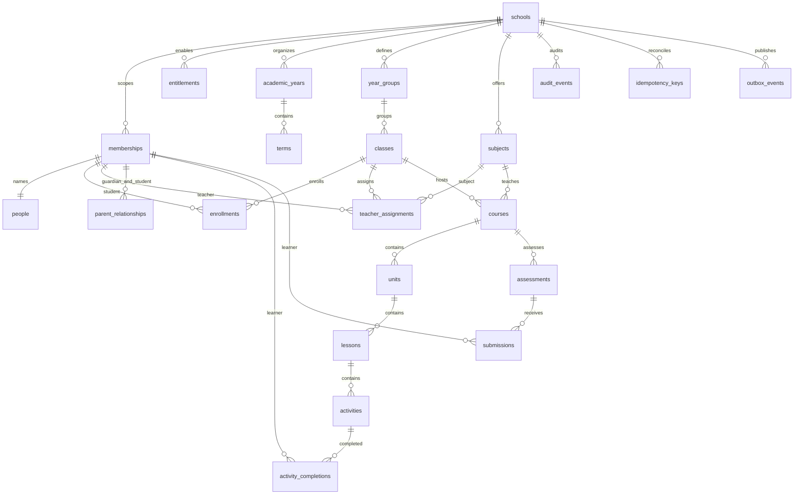

# Cuevo domain ERD

The foundation stores current school relationships in private app tables and reliability records in internal tables. Every relationship to a tenant record includes school_id. Global curriculum source/pack contexts and academic immutable revisions are planned in the source specifications; this diagram covers implemented foundation and learning records only.

Membership/relationship status and effective windows authorize new access. Source Auth subject UUIDs identify actors; client-submitted role/learner/school claims do not establish identity. Immutable completions/submissions are source activity records, not grades or attainment. Audit/idempotency/outbox records remain private and only purpose-limited server functions access them. A future academic release must atomically persist result revision, evidence links, projection, audit and outbox as required in 17 and 38.
