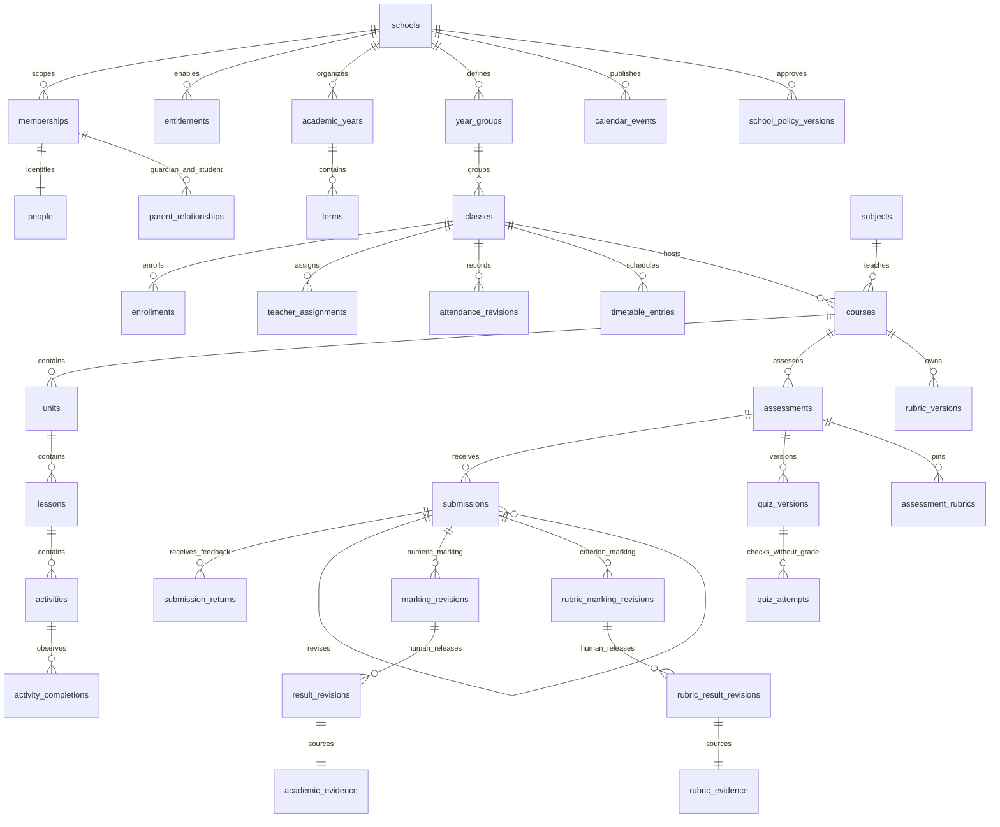
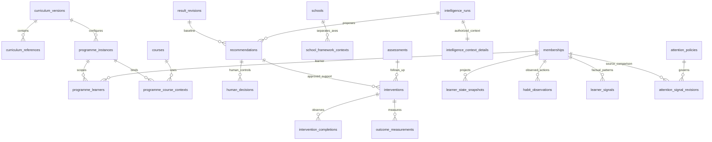
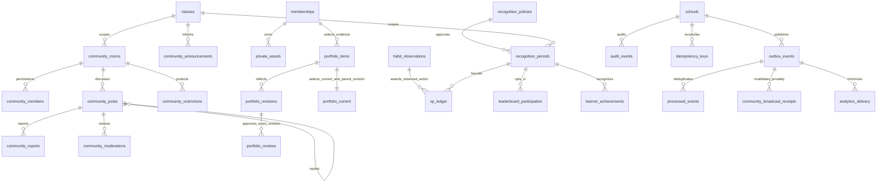

# Cuevo domain ERD

This map describes the implemented Technical MVP schema. The append-only migrations in supabase/migrations are authoritative. Every tenant-owned relationship uses composite school_id keys. Diagram edges summarize relationships and do not grant access.

Current pointers select a submission, released numeric result or rubric result without rewriting prior evidence; marking reads resolve the latest revision. Draft, return, closure and availability versions are independent of academic authority. Quiz checking returns CHECKED_NOT_GRADED. Native rubric criterion levels are never converted into an invented scalar.

Programme versions, jurisdiction overlays and quality contexts are separate. Synthetic School Custom packs prove technical mechanics. Official curriculum contexts remain pending until source, rights and academic acceptance are satisfied. Learner state retains independent academic, development, engagement, support and impact dimensions. Intelligence runs retain source/tool/policy/provider/mode provenance; only a separate human decision can create support. Outcomes compare compatible native baseline and follow-up evidence without claiming causation.

Private assets retain metadata, checksum and lifecycle; bytes stay in a private Storage bucket. Portfolio parent pointers retain the exact approved revision and can be revoked independently of a newer learner edit. Recognition uses approved observed practice/revision/reflection, current class scope and period deduplication. Community messages remain school-scoped with current membership, moderation and restrictions; Realtime carries minimal invalidations and content is fetched through the authorized API.

The API runtime is a non-owner, non-BYPASSRLS role. New tables have explicit grants/policies and are not exposed through the Data API. Reliability records stay private; workers execute constrained functions rather than raw authoritative table mutations. Current role, entitlement, membership, guardian and programme checks apply to new commands and retries.
