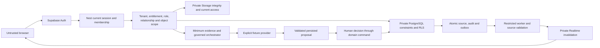

# Cuevo Technical MVP threat model

Scope: the implemented local synthetic five-role application, private database, worker, Storage, Realtime and fixture intelligence. This is an engineering threat model. Verification and remaining acceptance are recorded in [implementation status](../implementation-status.md). The established filename is retained so navigation resolves to one current model.

## Trust boundaries

The browser and retrieved content are untrusted. Supabase Auth verifies tokens; Nest checks the current stored session, membership, entitlement, role and object relationships. The server database credential can set transaction-local actor/school identity and is a trusted secret. The API role is a non-owner without BYPASSRLS. Private fixed-search-path helpers authorize their specific purpose; privileged execution does not permit arbitrary commands.

## Assets, attacks and controls

| Risk | Implemented control | Verification / boundary |
|---|---|---|
| Forged role, school or identity | Auth plus current stored session/member; no user metadata authority | Identity/current-session SQL and real API denials |
| Cross-tenant or sibling access | Composite foreign keys, current role/guardian/object/programme checks, private RLS | Tenant, parent result/evidence/portfolio and programme revocation cases |
| Replay after access changes | Reauthorize before stored response and after provider/Storage work | Learning, academic, intelligence, asset and community retries |
| Academic or curriculum authority injection | Immutable native histories, complete rubric criteria, exact approved version; human release | Numeric/rubric zero/missing/correction/source tests; official packs pending |
| Duplicate or uncertain mutation | Fingerprint reservation, atomic transaction, original-key reconciliation | Collision/rollback/lost-receipt cases; browser journal is process memory |
| Async loss, duplicate or ordering | Transactional outbox, restricted leases, source resolution, processed-event dedup | Worker cases and scratch recovery drill; failed events require review |
| Stale attention | Current policy/window/source/programme/availability checks on cached reads | Decline/missing/closed-policy/peer-parent denials |
| Unapproved parent edits | Separate exact approved portfolio pointer and current guardian | Prior revision retained; reviewer can revoke despite newer edit |
| Child messaging abuse | Current class/group roster, school policy, report/moderation/restriction and per-actor limits | Community API/SQL/private joins; unrestricted student messaging excluded |
| Public/client-written Realtime | Private-only local tenant, topic/session/room authorization, restrictive INSERT policies | Private joins and client Broadcast/Presence denials; API refetch for content |
| Private file disclosure/overwrite | Staged type/name/size/checksum, readback, reauthorization, retirement | API/SQL/browser bytes; no malware-scan certification; delivered bytes cannot be recalled |
| Prompt/content injection or AI authority | Authorized numeric facts/source IDs through declared tools; strict output/provenance/action schema | Source-78 fixture evaluations and approval loop; live provider unverified |
| Analytics content or revoked policy | Latest explicit school approval, synthetic-only allowlist, HMAC IDs, private claims/minimized atomic sink | Claim/revocation/dedup/sink cases; no raw messages/answers/prompts; live PostHog pending |
| Enumeration/resource exhaustion | Bounded parameterized queries/body/response, timeouts/pools, read/write/address budgets | Budget/HTTP/query tests; process-local limits supplement deployment gateway |
| XSS, SQL injection, cross-origin | React text, parameterized SQL, schemas, explicit CORS, Helmet, bearer tokens outside persistent storage | Contract/API/browser cases; no arbitrary imported HTML/code execution |
| Secret/raw error exposure | Ignored server config, sanitized responses/correlation, route-template telemetry, public-only web build | Raw/encoded bundle scan; only local API container receives Storage credential |
| Backup omits bytes | Consistent database snapshot restore and separate private byte backup | Scratch table hashes/byte SHA/lease/cleanup; production retention/recovery pending |

## Operating assumptions and remaining acceptance

Development contains synthetic people only. Owner/migration access is privileged local setup/recovery and never models a browser or staff credential. Compromised API, migration or Storage credentials have broader impact than a compromised client and require protected deployment/CI. Local verification does not establish production pupil, regional, legal or school acceptance.

Fixture intelligence is explicitly enabled only for the documented local Auth endpoint (loopback or Docker gateway on 56321), forbidden in production, and labeled in persisted runs/UI. It proves orchestration and authority controls, not live-model quality. Official England/Cambridge/Qatar artifacts need source, rights and academic review before customer claims. Production requires separate credentials, gateway/session policies, regional/contracts approval, monitored recovery and independent security acceptance.
