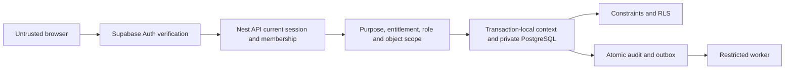

# Cuevo foundation threat model

Date: 2026-10-01. Scope: current school/identity/learning foundation. This is an engineering threat model, not a security certification.

## Trust boundaries

The browser is untrusted. Supabase Auth verifies the access token; the Nest API checks the current stored Auth session and membership, then resolves school, entitlement, role and object relationships. The API database credential can set transaction-local identity context and is therefore a trusted server credential. It never reaches the browser. The database runtime role is non-owner and non-BYPASSRLS. Narrow privileged policy helpers are private and fixed-search-path; they enforce current stored scope. The worker has separate credentials and access only to constrained outbox delivery functions.

## Protected assets and evidence

| Asset / risk | Required control | Current evidence / limit |
|---|---|---|
| Pupil identity and relationships | Current school/member/relationship scope; private schemas | Real RLS tests, session and relationship revocation tests |
| Account/session impersonation | Auth server verifies token; current auth.sessions ownership | API requires live session and current membership; no JWT user_metadata role trust |
| Cross-school object access | Composite school foreign keys, actor/school policies, server checks | Isolation tenant and direct SQL denial cases; learning cases being expanded |
| Academic authority | Human-authorized server commands, immutable revisions | Academic release is not implemented yet; no AI grade write exists |
| Duplicate/uncertain commands | Fingerprint idempotency and transaction | Replay collision and rollback tests; UI retains attempted key in memory |
| Replay after revoked access | Current object checks before any stored-response return | Learning review identified gap; remediation in progress |
| Audit tampering | Private append-only audit; immutable triggers | UPDATE/DELETE/TRUNCATE denial tests |
| Async event loss / duplicates | Atomic outbox, lease tokens, retry bounds, dedup | SQL delivery/recovery assertions pass; worker processing not yet implemented |
| API dependency failure | Readiness validates Auth/database/schema/grants; sanitized errors | Review fixes tested; no raw credential/errors in responses |
| Secret leakage | Ignored server env, explicit public config, least container variables | Browser bundle scan zero secret matches; Docker verification tracked separately |
| Excessive permitted queries | Page and aggregate response budgets | List max100; nested course tree review remediation in progress |
| XSS / malicious content | Render content as text; no executable imported pack or raw HTML | React text content surfaces; attachment handling deferred |
| AI context/authority injection | Minimum authorized context, structured proposal, human approval | Live AI not configured; workflow implementation and evals remain required |
| Child community abuse | School scope, current membership, moderation/report/block/restrict | Community is not implemented yet |
| Private files and realtime | Private buckets/channels, current relationship checks | Not implemented; cannot claim file or realtime security passes |
| Curriculum/compliance misinformation | Source locks, rights and independent review gates | Generic pack validator rejects missing authority; official bundles absent |

## Operational limits

Development uses synthetic fixtures. PostgreSQL owner/migration access is privileged and never represents a browser or normal staff credential. A compromised API or migration credential has broader impact than a compromised client; protect secret provisioning, deployed environment and CI permissions. Production requires separate infrastructure, policy/residency approval, restore drill, session controls and full threat-test matrix verification. Pseudonyms are not a substitute for privacy/legal approval. Previously delivered bytes cannot be recalled after access revocation; new reads and actions must be denied.
