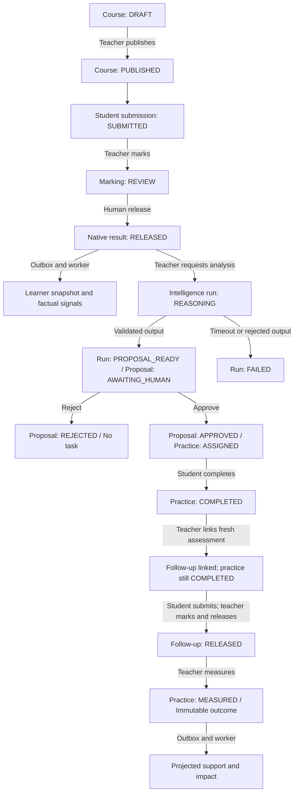

# Closed-loop state QA and root-cause map

Audit date: 1 October 2026, Asia/Riyadh. This document explains the current implementation and how to test it. It is not a release certification or a replacement product specification.

Read the [manual frontend walkthrough](mvp-developer-testing.md) for account/class setup and exact happy-path buttons. Governing sources include [01 gates](product/overview/01-MVP-SCOPE-AND-GATES.md), [04 evidence](product/domains/04-EVIDENCE-AND-LEARNER-GRAPH.md), [08 state](product/domains/08-LEARNER-STATE-MODEL.md), [10 orchestration](product/domains/10-INTELLIGENCE-ORCHESTRATOR.md), [11 events](product/domains/11-SIGNAL-REALTIME-AND-AUTOMATION.md), [13 learning](product/domains/13-LMS-LXP-FUNCTIONAL-SPEC.md), [17 assessment](product/domains/17-ASSESSMENT-GRADEBOOK-FUNCTIONAL-SPEC.md), [21 improvement](product/domains/21-CQI-AND-IMPROVEMENT.md), [43 tests](product/verification/43-TESTING-GOLDEN-CASES.md), [64 demo](product/verification/64-MVP-DEMO-SCRIPT.md), [77 fixtures](product/verification/77-REFERENCE-SCHOOL-SYNTHETIC-DATA.md), [78 evaluations](product/verification/78-AGENTIC-AI-EVALUATION-HARNESS.md) and [83 exit](product/overview/83-MVP-EXIT-CRITERIA.md).

## Audit scope and evidence limits

The checkout was `codex/customer-readiness-hardening`, HEAD `946cca0d9d31a128a950c64ddeb4507d72806ab2`, with concurrent uncommitted changes. Live application code and SQL helper definitions were changing during inspection. The migration history's latest version was `20261001132444`; new hardening versions `20261001161916` and `20261001162203` were not registered. Nevertheless, helper functions introduced by that hardening were present in the database. Therefore the current database is not proven identical to either the earlier frozen manifest or the authored migration tree. Do not mark pending repairs verified from their presence on disk or from migration-history names alone.

This audit read source, existing tests, QA reproduction receipts and local synthetic database rows. It performed read-only authenticated browser navigation and API reads. It did not apply migrations, create/release academic work, approve proposals, reset data, run rollback suites or rerun the complete acceptance cycle. Browser login/logout creates ordinary authentication sessions. The server stopped during concurrent hardening; one subsequent browser check failed at navigation with connection refused and provides no product-state result.

The [customer QA register](product/qa/CUSTOMER-READINESS-FINDINGS.md) contains earlier independent reproductions of source authorization, stale-context approval, duplicate current results, projection capacity and configuration races. Those are reported prior evidence, not new reproductions in this audit. The [historical exit matrix](reports/technical-mvp-exit-matrix.md) binds its passing results to a different frozen source snapshot. Both scopes must remain explicit.

## What the application actually does

Several independent state machines cooperate; there is no single stored `closedLoopStatus` covering all screens.



The learner snapshot and signals do not automatically call intelligence in the current implementation. Analysis requires a teacher/admin request selecting a baseline result. Reassessment linking and outcome measurement are also manual. The fixture provider supplies a fixed guided-practice action; it does not establish live interpretation quality. Numeric evidence enters this improvement workflow. Rubric evidence supports marking/release/state but is filtered out of the improvement selectors.

Actual status vocabularies:

| Owner | Stored/API states | Important distinction |
|---|---|---|
| Course | `DRAFT`, `PUBLISHED` | Course publication is separate from completing its activities |
| Working text | `DRAFT`, revision | Private mutable server draft; not a teacher submission |
| Submission pointer | `SUBMITTED`, `RETURNED`, `RESUBMITTED`, `CLOSED` | Source submission records and return history remain immutable |
| Academic marking/result | `REVIEW`, `RELEASED`, revision | Correction is another revision; no separate stored CORRECTED result enum |
| Quiz attempt | `CHECKED_NOT_GRADED` | Checking answers does not release a teacher grade |
| Intelligence run | `REASONING`, `PROPOSAL_READY`, `FAILED` | Run lifecycle differs from service reservation NEW/IN_PROGRESS/COMPLETED/FAILED |
| Proposal | `AWAITING_HUMAN`, `APPROVED`, `REJECTED` | A ready proposal is not an assigned intervention |
| Intervention | `ASSIGNED`, `COMPLETED`, `MEASURED` | Follow-up linking sets a field, not a new status |
| Outcome | `improved`, `no_meaningful_change`, `inconclusive` | No compatible result means no outcome yet, not zero change |
| Learner state | `UNKNOWN` or `READY`; freshness CURRENT/STALE/APPROVED_PROJECTION where supplied | READY means a validated projection exists; it does not certify full learning coverage or all current-source authority |
| Outbox | `PENDING`, `PROCESSING`, `COMPLETED`, `FAILED` | COMPLETED can be an acknowledgment of a non-projecting event; inspect processed source and snapshot too |

## Four checkpoints for every transition

1. **Presentation:** correct role, learner/object, button state, message, durable state after leaving/reopening, and handling of empty/error/unknown conditions.
2. **Command/read boundary:** exact endpoint, sanitized status/code/request ID, idempotency key, receipt object ID, source/policy/marking revision and school scope. Do not share bearer tokens.
3. **Persisted domain truth:** the intended source/current pointer/decision/outcome, matching audit and outbox records, and no forbidden duplicate or partial mutation.
4. **Projection and visibility:** processed source identity, learner-state version/time/source IDs, current authorized teacher/student/coordinator reads and explicitly approved parent projection.

A button message proves presentation. A receipt proves the command reported success. A database row proves persistence. A current authorized later read and processed source prove the intended projection. QA needs agreement between these checkpoints.

Keep one run ledger:

```text
schoolId, learnerId, classId, courseId
objectiveId + version, assessment model + policyVersion + raw maximum/rubricVersion
baselineAssessmentId, baselineSubmissionId + revision
baselineMarkingId + revision, baselineResultId, baselineEvidenceId
intelligenceRunId, recommendationId, humanDecisionId, interventionId
completionId + completedAt, followUpAssessmentId
followUpSubmissionId + submittedAt, followUpResultId + releasedAt
outcomeId, threshold, signed difference
requestIds, outboxEventIds, processed source types/IDs, snapshot version/time
```

Unique titles help locate records but do not establish identity. All roles must follow the same IDs. Do not demonstrate an unrelated seeded improvement as closure of your new course.

## State-by-state QA matrix

Statuses in this table are expected test oracles. They are not claims that each case passed in this audit. Most successful commands return HTTP 200; rejected input/scope/state commonly returns 400/401/403/404/409, while dependency or uncertain transport failures can return 503. Read the actual sanitized code and operation, not just a generic HTTP label.

| Case | Initial state and role | Action / boundary | Required result and negative assertion |
|---|---|---|---|
| CL-01 Access | Current synthetic teacher/student/guardian | Login; `GET /v1/me` | Current membership verified; role/entitlement/object scope correct. Suspended, expired or unrelated access must not reveal protected data |
| CL-02 Draft course | Teacher, valid class/subject | `POST /v1/courses`; student attempts course read | Staff sees DRAFT; student cannot read draft. Audit/event match course ID |
| CL-03 Publication | Teacher-managed course | `POST /v1/courses/:id/publish` | PUBLISHED and student-authorized later read. Current code permits empty publication; record that as a workflow-design limitation rather than infer learning completeness |
| CL-04 Activity | Student, published course, current enrollment/programme | `POST /v1/activities/:id/complete`; leave/reopen | One persisted completion and eventual observation. Reopened UI must reflect completion; same-source retry must not multiply observations/recognition |
| CL-05 Draft text | Available TEXT assessment, student | Open draft, type, save via `/v1/assessments/:id/draft`, leave/reopen | Exact text/revision recovered; teacher cannot see private draft. Failed save/mode switch/refetch must not silently discard unsent text |
| CL-06 Submission | No current source, assignment available | `POST /v1/assessments/:id/submissions` | Immutable SUBMITTED revision 1, current pointer, teacher queue/source text, draft consumed. No authoritative grade or result yet |
| CL-07 Return/resubmit | Open TEXT source, teacher then student | `/submissions/:id/return`; `/submissions/:id/resubmit` | RETURNED feedback; new RESUBMITTED revision linked to old source/return ID. Old source unchanged; current attempt ungraded until new marking. Returned/closed source marking denied |
| CL-08 Close/availability | Open source or unavailable assessment | `/submissions/:id/close`; attempt late/closed/future submit | CLOSED source or unavailable state prevents unsupported action. Test effective-time boundaries and late policy. No reopen command currently exists |
| CL-09 Objective/model | Teacher, approved compatible reference/rubric | `/assessments/:id/reference` or `/rubric` | Expected policy version advances; source/model frozen once marking history exists. Unapproved, stale or programme-incompatible context denied |
| CL-10 Mark draft | Current submitted source, teacher | `POST /v1/submissions/:id/results` | REVIEW with correct source, policy, score/native criteria and revision. Student/parent cannot see draft; zero preserved; incomplete/foreign rubric or out-of-scale input denied |
| CL-11 Release | Latest valid REVIEW, teacher | `POST /v1/results/:markingId/release` | Atomic released revision + evidence + current pointer + audit + outbox. Student sees exact source; parent sees it only if explicitly approved. Duplicate command creates no second release |
| CL-12 Correction | Prior release, current open source | Create correction draft, then release new revision | Before release old result stays current; afterward new revision current and old evidence retained. Reusing stale marking/policy denied. Also test return/resubmit/release replacement |
| CL-13 Projection | Release/completion events persisted | Inspect event processing and `GET /v1/learners/:id/state` | Processed source IDs lead to native academic/development/engagement state; new version/time. UNKNOWN and STALE remain explicit; pending is not lost data |
| CL-14 Signal | Appropriate source and approved factual policy | `/v1/signals`, `/v1/attention-signals`; staff refresh | Observed count/decline/missing-work source/window/rule correct. Missing work not zero; no inferred traits. Do not expect automatic intelligence or automatic deadline scan |
| CL-15 Analysis | Teacher/admin, compatible released numeric baseline | `POST /v1/intelligence/analyze` | REASONING then PROPOSAL_READY; recommendation AWAITING_HUMAN, exact run/evidence/native facts and bounded authorized context. No intervention/grade/access mutation |
| CL-16 Failed/unknown analysis | Provider timeout/invalid output, active run or lost response | Controlled fault; repeat original key/payload | Definitive FAILED has durable failure receipt and no proposal/task. COMMAND_IN_PROGRESS/OUTCOME_UNKNOWN preserves original key and reconciles once; never manufacture success |
| CL-17 Approve | Current AWAITING_HUMAN, teacher/admin | `/v1/recommendations/:id/decision` APPROVE | Immutable reason/edited instructions, APPROVED, exactly one ASSIGNED task, audit/event. Student cannot approve; stale contributing evidence/programme must deny |
| CL-18 Reject | Independent AWAITING_HUMAN | Same endpoint REJECT | REJECTED with reason; no intervention, completion or outcome; learner sees no task. Opposite later decision conflicts |
| CL-19 Complete support | Own ASSIGNED task, student | `/v1/interventions/:id/complete`; leave/reopen | COMPLETED + immutable completion/reflection. Teacher/other learner denied. Completion is an attestation, not proof of activity execution or academic improvement |
| CL-20 Link follow-up | COMPLETED support, teacher/admin | `/v1/interventions/:id/reassessment` | Same course/reference/raw maximum, different numeric assessment; link retained and status still COMPLETED. Wrong context or changed already-fixed link denied |
| CL-21 Fresh follow-up | Practice completed first | Student submits new follow-up; teacher marks/releases | Exact learner/objective/version/scale; submittedAt and releasedAt both later than completedAt. Missing/draft/old source not eligible. Confirm discoverability from frontend without API setup |
| CL-22 Measurement | Valid linked released follow-up | `/v1/interventions/:id/measure` | Immutable signed raw difference/threshold/native baseline/follow-up; task MEASURED. No grade rewritten and no causal claim. Wrong learner/version/scale/time/stale source must deny |
| CL-23 Project closure | Approval/completion/link/outcome events | Compare `/interventions`, `/outcomes`, learner state and staff class summary | Same IDs at every level; processed prerequisites, MEASURED support and matching outcome. Parent excludes internals; no unrelated-class source |
| CL-24 Recovery | Sent command/worker event, fault or duplicate | Original-key replay, reconnect, event retry/lease expiry | One domain mutation, deduped observation/event, eventual source projection. Changed payload conflicts. Auth revoked before retry denies; retained sent-command journal does not protect unsent edits |
| CL-25 History/scope changes | Completed/measured loop | Correct baseline/follow-up, resubmit, transfer/revoke programme/guardian | Current views and historical evidence remain coherent; denied source cannot be used for new approval/measurement. Existing support treatment after correction requires explicit policy review |
| CL-26 Volume and paging | 101+ results/sources/objectives/interventions; 1001+ historical events | Navigate later pages, process new event | No false not-submitted/missing-objective state; no indefinite poisoned event. Bounded totals/returned/truncation/continuation disclosed; unrelated learner still progresses |
| CL-27 Native rubric boundary | Released rubric result | Inspect improvement eligibility | Current loop does not support rubric baseline/measurement. Record unsupported scope explicitly; never convert criterion levels to a guessed numeric scale |
| CL-28 Role/UX matrix | Each major state | English/Arabic, desktop/tablet/390px, keyboard, reduced motion, error/offline | Correct role/learner context, visible focus, readable action, no overflow or leaked protected state; reconnect requires membership revalidation |

## Outcome branch oracles

Use separate interventions for each branch: an outcome is immutable and unique per intervention. These scores/thresholds are technical test values, not an official grading rule.

| Baseline / follow-up / threshold | Expected current implementation |
|---|---|
| 0/10 → 3/10, threshold 2 | improved, signed difference +3 |
| 0/10 → 2/10, threshold 2 | improved at exact threshold |
| 0/10 → 1/10, threshold 2 | no_meaningful_change, signed difference +1 |
| 3/10 → 3/10, threshold 2 | no_meaningful_change, difference 0 |
| 3/10 → 2/10, threshold 2 | no_meaningful_change, difference −1 retained |
| 3/10 → 0/10, threshold 2 | inconclusive, difference −3, reason FOLLOW_UP_LOWER |
| No released follow-up | No valid outcome; support remains unmeasured. Never interpret missing as 0 or unchanged |
| Follow-up maximum 20 while baseline maximum 10 | Deny incompatible raw scale; no normalization invented |
| Wrong learner/objective/version, earlier submission or release | Deny; no measurement/outbox/state change |
| Superseded corrected follow-up ID | Required stale-source denial oracle; current implementation lacks an explicit pointer check and needs adversarial reproduction |

Source08 lists declining and insufficient-evidence impact meanings. The implemented outcome vocabulary uses inconclusive for a large decline and absent measurement for missing evidence. Product review must resolve whether additional explicit states are required; QA must not silently map missing to zero or decline to improvement.

## Evidence-backed root causes

| Finding | Evidence and confidence | Why happy-path testing misses it |
|---|---|---|
| Persisted activity looks incomplete on revisit | Reproduced in this audit: database held student012's completion for course `School learning 5d7cabbe`, activity `Try the practice`; reopened frontend offered Complete activity. API activity fields contained no completion status. [Local state](../apps/web/features/learning/components/course-editor.tsx), [detail query](../apps/api/src/modules/school-learning/learning.service.ts) | School-learning browser checks immediate success only; navigation remount clears local IDs |
| Saved/unsent draft recovery gaps | Initial inspected source fetched the server draft only after explicitly opening it and remounted forms on mode/revision. Concurrent hardening now opens the server draft on entry and retains scoped form values in [submission lifecycle](../apps/web/features/learning/components/submission-lifecycle.tsx) / [CommandForm](../apps/web/shared/components/command-form.tsx). This pending repair was not browser-verified because the server stopped | Existing regression opens draft first and uses its same-session save receipt; it does not type before switching or reopen later |
| Signal is not linked to analysis | Source-confirmed: [analyze contract](../packages/contracts/src/improvement.ts) accepts baselineResultId only; teacher manually calls analysis; worker does not schedule intelligence | Main browser test starts from a selected released baseline, not a persisted trigger signal |
| Fixture/numeric support narrower than product loop | Source-confirmed: [fixture provider](../apps/api/src/modules/improvement/fixture-provider.ts) selects fixed guided practice; [UI](../apps/web/features/improvement/components/improvement-workspace.tsx) filters numeric; service has no default LIVE adapter | Numeric fixture output is fast/deterministic and cannot validate interpretation/personalization or rubric intervention |
| Current authority differs by surface | Prior independent QA reproduced cross-class evidence, withdrawn learner/parent state and stale-context approval; see [receipts](product/qa/CUSTOMER-READINESS-FINDINGS.md). Pending repairs and mixed live SQL require fresh replay evidence | One class/programme and unchanged relationships do not test source-level disagreement |
| Current result differed from current submission | Prior QA reproduced duplicate current result after replacement resubmission, with immutable history correctly retained | Initial submission/release never supersedes its own source |
| Follow-up currentness / corrected support treatment | Source-confirmed candidate: [measurement](../supabase/migrations/20261001004542_improvement_semantic_integrity.sql) checks compatibility/time but not current pointers; [baseline hardening](../supabase/migrations/20261001161916_customer_current_source_authority.sql) changes existing task management scope. Not reproduced in this audit | Tests submit and measure the current source without intervening correction/resubmission |
| Independent page loading creates misleading absence | Source-confirmed: assessment/submission and marking/objective pages loaded separately; UI joins loaded arrays rather than exact object read. [Assessment UI](../apps/web/features/learning/components/assessment-view.tsx), [academic guard](../apps/web/features/academic/model.ts) | Small fixture sets fit first page; tests load target rows but not all related source pages |
| Refresh unmounts unsaved forms | Initial inspected [query hook](../apps/web/shared/hooks/use-api.ts) cleared data and [improvement workspace](../apps/web/features/improvement/components/improvement-workspace.tsx) replaced lists while loading. Concurrent hardening now adds scoped working-text retention and adjusts query/session behavior. Do not call unsent-loss fixed or still present without reauthorization/reopen browser checks | Test fills and saves without same-scope refresh/token renewal; command-retry coverage alone cannot establish unsent-edit retention |
| Normal history can poison projection | Prior QA reproduced 101 result / 1001 source failures before ACK. [Support helper](../supabase/migrations/20261001083322_source_linked_support_impact.sql) still has lifetime intervention/source ceilings in inspected source | Small A–G fixtures do not reach those bounds; bounded academic fixes need support-path stress too |
| Closure/readiness not automatically advanced | Source-confirmed: no reassessment/deadline scheduler found in API/worker timers; projection Refresh reads state, it does not execute missing workflow actions | Tests deliberately perform every link/release/measure and do not wait for absent automation |
| Correction history is hard to inspect | Source-confirmed: Released results is current-only; submission history is work history. Prior result evidence remains in DB/API but no academic-history screen is exposed | Tests already captured evidence IDs and can request history directly |
| Tests aggregate different paths | [Improvement E2E](../tests/e2e/improvement-loop.spec.ts) API-prepares course/baseline and later API submits/marks/releases follow-up; UI covers middle/end. It is independent and source-linked, but not a single browser-only journey | API setup can succeed even when equivalent UI selection/resume/discoverability is awkward or absent |

## A concrete persisted chain inspected in this audit

This was an existing test run, not a newly executed end-to-end scenario:

| Artifact | Local synthetic ID / result |
|---|---|
| Learner | `20000000-0000-4000-8000-000000000012` |
| Baseline result | `c0a7a891-7b4c-41c5-b263-3b2988a7295b`, 0/10 |
| Recommendation | `668eb8e7-624b-4e93-85f5-a2dee1ec7e73`, APPROVED |
| Practice | `5fe45b7e-440e-4a22-bd43-9d16285afb67`, MEASURED |
| Follow-up result | `cd43c490-cab5-40fc-905f-84b46b92e073`, 3/10 |
| Outcome | `10235e73-34ce-49e7-812e-b7aff5822cd6`, improved, difference 3, threshold 2 |

Read-only queries confirmed both results were current, follow-up submission and release were after completion, matching approval/completion/reassessment/outcome events were COMPLETED with processed source identities, and snapshot version56 contained the same intervention and outcome. `recommendation.created` was acknowledged without a projected source type, illustrating why event acknowledgment alone does not prove learner-state change. All523 queue events were COMPLETED at one observation; this does not prove capacity/recovery or every learner scenario. This chain does not include verified same-run signal provenance.

## Locate the first broken boundary

| Symptom | First check | Root-cause direction |
|---|---|---|
| Button exists but no request | Client validation, selected object, disabled/loading state, Console | UI/form problem |
| POST rejected | Sanitized code, policy/source revision, role/relationship, publication/availability/programme | Input/state incompatibility or authorization; do not retry a new key blindly |
| POST success but no durable source | Exact receipt ID and authorized later read; source/audit/outbox transaction | Persistence/receipt integrity; transport success alone insufficient |
| Source exists but current list omits it | Current submission/result pointers, correction, current source authority and pagination | Current projection/filter or stale source, not necessarily deletion |
| Source/event exists but Progress does not | Outbox state/lease/retry/error, processed source type/ID, snapshot version/source IDs | Worker failure, source prerequisite/order, missing policy or stale projection |
| Snapshot correct but screen wrong | API response/parser, selected learner, loaded pages, local component state | Frontend projection/hydration/paging problem |
| Next steps differs from Progress | Direct intervention/outcome rows versus processed snapshot; same IDs; source authority | Processing lag or differing access/freshness predicates |
| No automatic analysis/follow-up | Inspect required manual action and supported automation policy | Missing automation/affordance, not queue latency |
| Reopen loses completion/text | Compare persisted row with detail response and form local state | Resume/read-contract gap |
| Parent/staff sees denied source | Compare current report/source GET with state/class projection using same identity | Authorization/projection defect; preserve exact sanitized evidence |

## Local read-only developer probes

Use only the named synthetic local Docker database. These queries do not mutate state. In role-sensitive QA, privileged developer SQL shows persisted truth but does not prove RLS: separately issue the same object's API read under the actual teacher/student/parent identity. Never use browser database credentials or modify protected rows to make a case pass.

```powershell
docker exec supabase_db_cuevo psql -U postgres -d postgres -X -c "SELECT version FROM supabase_migrations.schema_migrations ORDER BY version DESC LIMIT 8;"

docker exec supabase_db_cuevo psql -U postgres -d postgres -X -c "SELECT state,count(*),max(attempt_count) FROM internal.outbox_events GROUP BY state;"
```

For one run, replace the synthetic IDs below with values captured from actual command receipts. Keep explicit school scope:

```sql
SELECT id, type, entity_type, entity_id, state, attempt_count,
       lease_until, last_error_code, occurred_at, completed_at
FROM internal.outbox_events
WHERE school_id = '10000000-0000-4000-8000-000000000001'
  AND entity_id IN (
    '668eb8e7-624b-4e93-85f5-a2dee1ec7e73',
    '5fe45b7e-440e-4a22-bd43-9d16285afb67',
    '10235e73-34ce-49e7-812e-b7aff5822cd6'
  )
ORDER BY occurred_at;

SELECT e.id, e.type, e.state, p.source_type, p.source_id, p.processed_at
FROM internal.outbox_events e
LEFT JOIN internal.processed_events p ON p.event_id = e.id
WHERE e.school_id = '10000000-0000-4000-8000-000000000001'
  AND e.entity_id = '5fe45b7e-440e-4a22-bd43-9d16285afb67'
ORDER BY e.occurred_at;

SELECT action, entity_type, entity_id, request_id, outcome, occurred_at
FROM internal.audit_events
WHERE school_id = '10000000-0000-4000-8000-000000000001'
  AND entity_id = '10235e73-34ce-49e7-812e-b7aff5822cd6'
ORDER BY occurred_at;

SELECT version, generated_at, source_event_ids, support, impact
FROM app.learner_state_snapshots
WHERE school_id = '10000000-0000-4000-8000-000000000001'
  AND learner_id = '20000000-0000-4000-8000-000000000012';
```

The worker polls every second, claims at most10 events with30-second leases, and handles each through a private source processor. Failure uses a sanitized reason and bounded retry. Allow a short projection wait in ordinary QA, but do not label missing prerequisites, permanent failure or unsupported automation as latency. Health readiness checks dependencies/permissions; it does not attest that a particular loop finished.

## Verification plan and acceptance record

Run adversarial state tests only with a stable source/runtime/database snapshot and an exclusive mutation window. SQL rollback fixtures, revocation integration tests, browser journeys and recovery must not mutate shared data concurrently. Stop worker for rollback source-replacement suites. `verify:technical` performs a guarded local reset; read [verification operations](../scripts/verification/README.md) first.

The next useful acceptance increment is one **browser-only** scenario from authoring through coordinator/parent closure, carrying the same IDs. Then test CL-18 rejection, all outcome branches, draft/reopen/refresh, corrected sources before approval and measurement, response-loss retry, current programme/guardian withdrawal, incompatible follow-up and 101/1001 paging/capacity independently. Hybrid browser and API/SQL tests remain useful but must disclose their setup/boundaries.

For interactive existing coverage:

```powershell
npm run e2e -- tests/e2e/improvement-loop.spec.ts --ui
npm run e2e -- tests/e2e/learning-lifecycle.spec.ts --debug
npm run e2e -- tests/e2e/improvement-loop.spec.ts --trace retain-on-failure
```

The improvement happy path does not cover every state in this matrix. The earlier full run of28 journeys and subsequent focused curriculum correction are previous-turn evidence, not a fresh current-branch acceptance run.

Each case record should include initial state, role, same-run IDs, exact steps, expected and actual state, sanitized request/receipt, persistence/audit/outbox, projection/source evidence, before/after/reopen screenshots, and whether another role's forbidden view was tested. Use NOT_RUN, PASS, FAIL, BLOCKED_BY_SETUP, REQUIRES_REVIEW or UNSUPPORTED_SCOPE explicitly. Never count a mock, seed-created row, acknowledged event or screenshot as proof of a transition it did not exercise.
