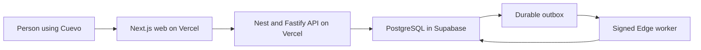
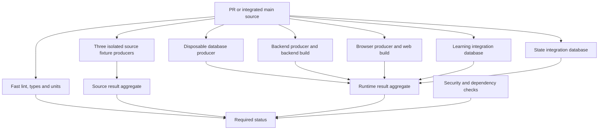
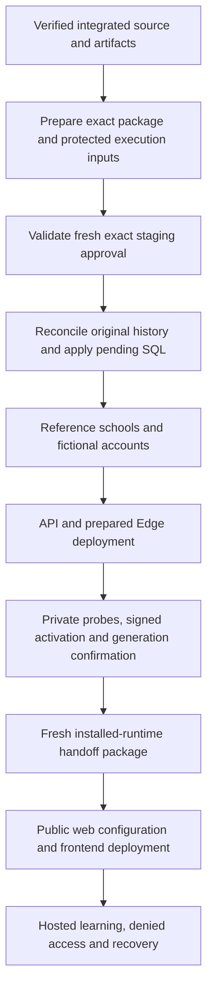

# Cuevo release process: implementation and team review

Prepared 11 October 2026, Asia/Riyadh. Review baseline: signed local commit `38411a402867a68e59d32a26ce9148d3c036d1a6`, tree `0eb764388770bd817c4d0f5759bd03616957a5d5`. The changes are local and unpublished. This document requests review of the implemented process; it does not approve a merge, hosted effect or customer launch.

## The decision in plain language

Keep the application architecture. Simplify release execution inside the existing owners, preserve completed work, and verify current provider state immediately before changing it.

The earlier audited repairs are implemented with local tests and bounded independent review. The later full candidate review identified an additional activation-export contract blocker. Its bounded correction has passed local owner tests and awaits independent review. The current complete protected CI and hosted deployment have not run. We therefore have a reviewable work in progress, not a proved smooth deployment or a permanently fault-free system.

The agreed **20–25-minute deployment target remains unmeasured**. Report CI, preparation, first database installation, account creation, provider deployment and hosted acceptance separately. A passing local test count is not hosted installation progress.

## What is actually hosted

The latest official Supabase read was 10 October at 19:35 UTC. Vercel deployment inventory was read at 18:21 UTC. These are dated observations; no provider writes followed during this repair work.

| Milestone | Observed state | Required result |
| --- | --- | --- |
| Supabase migrations | 144 of 231 | Exact 231-file history and permissions verified |
| Tables | 113 application + 18 internal | Remaining reviewed schema installed |
| Fictional schools | 0 of 2 | Source-locked reference population |
| Fictional Auth accounts | 0 of 133 | Original IDs, account receipts and permissions verified |
| Supabase Edge worker | No function deployed at the last function inventory | Exact prepared content, signed execution and recovery verified |
| Vercel API | Zero deployments | Verified API delivery and normal protected access |
| Vercel frontend | Zero deployments | Connected frontend with hosted learning checks |

Supabase is in `ap-southeast-1`; Vercel API/web settings select `sin1`. These regions agree. PostgreSQL reports `max_connections=60` and three superuser-reserved connections. A snapshot of 14 connections is not a capacity guarantee. Provider pooler defaults returned null and remain unknown.

The existing first-install runtime connection recipe uses the shared session endpoint on 5432. The provider configuration response describes transaction mode on 6543; that response proves the shared host identity, not a tested session-capacity ceiling. Actual TLS, restricted roles and connection behavior still require hosted proof.

## Why delivery stalled

The application has several deployable components and substantial tenant, academic, privacy and recovery rules. Those explain useful testing. They do not justify the repeated release-repair loop.

The most material mistakes were in our delivery engineering:

1. Expensive preparation ran inside a short window intended for current hosted facts. Valid evidence became older than the unchanged 30-second limit before execution.
2. Nested owners reacquired immutable archives/source facts or retained a different observation clock. Individual tests passed while combined execution consumed stale evidence.
3. Recovery receipts and next-stage handoffs were not adequately proved together. A completed effect could leave its acknowledgement missing, preventing the next stage.
4. Provider tooling and dependency behavior were assumed before genuine execution proof. Image metadata, CLI inputs and Edge packaging exposed differences in actual environments.
5. Failure evidence was too broad or missing. Local reproductions passing did not explain failed CI, and generic provider failures hid their failed phase.
6. First private staging, optional CI optimization, future maintenance and customer launch work were repeatedly discussed together. That obscured the immediate delivery boundary.

Next.js and Nest/Fastify do not require this custom complexity. A small team would establish the first thin hosted path early, then prove permission and failure behavior on it. Our repairs retain the product/security rules while correcting the implemented execution sequence.

## Application and release are different systems

The browser does not receive database, service-role or AI secrets. API/domain/database owners enforce school, role, relationship and object access. The worker processes durable events under its restricted authority; a wake message is a delivery hint.

GitHub Actions executes CI and release scripts. It is not the whole release policy. The repository scripts also own source admission, original operation identities, provider effects, receipts, uncertainty and recovery.

Docker supplies isolated local/CI environments and protected prepared execution inputs. It prevents shared test-state interference when correctly configured. It does not eliminate migration replay, query cost, browser journeys or source verification, and it does not install the hosted project.

## The implemented CI structure

The final status consumes results rather than rerunning their suites. Each mutable test producer owns its database and restoration. Backend and frontend builds have separate owners. The admitted source test inventory currently has 160 files; API integration discovery has 103 files. File discovery is not proof that every required case executed.

The expensive continuation fixture is divided into five isolated process cohorts. Its policy checks the complete original case union and receipts; a filtered run with zero reported skips cannot silently become full-file acceptance.

PR scope remains conservative. Admitted feature changes can use the mapped focused scope; changes to release, Auth, migration, grants or worker controls require their relevant broader coverage. Integrated main produces its own source-bound database/runtime artifacts. A trusted PR-to-main evidence-reuse policy has not been implemented; same tree alone is insufficient.

Scheduled complete regression and frozen customer-candidate acceptance remain separate. The full-regression exporter retains minimized diagnostics, and ordinary source producers retain their partition receipts. The source-group runner also retains bounded local failure diagnostics. New generic provider diagnosis preserves fixed phase, nullable clocks, known wrapped HTTP status and cleanup certainty without raw exceptions. It does not determine whether a failure came from application, test or infrastructure.

## What repeated work was removed

| Implemented change | Benefit | What still runs for a reason |
| --- | --- | --- |
| Reuse captured immutable CI archives inside one admission | Avoid repeated downloads and decoding | Current original metadata, expiry and source/approval checks |
| Reuse authenticated recovery/source context | Avoid reparsing unchanged historical chains | Current native history, permissions and private records |
| Borrow one exact same-scope operation owner | Avoid repeated full nested preparation | Separate schema and runtime scopes; current effect admission |
| Batch immutable Git reads and retain bounded contexts | Reduce process/setup overhead | Final physical source and changed-head refusal |
| Split backend/web build ownership | Avoid duplicate application compilation in runtime producers | Different deployable formats and their acceptance tests |
| Five isolated continuation cohorts | Overlap independent scenarios safely | Every original case, denial and cleanup receipt |
| One source/integration test owner and result aggregation | Avoid rerunning suites inside their aggregate | Separate isolated producers needed for different state |
| One fixed connection-snapshot query shared by native sessions | Avoid copied query implementations | Each session's own TLS, client, lease and clock checks |
| Current project check validates identity and host settings together | Retire the redundant ID-only lookup | Separate initial intent admission and final effect readback |
| Completed installation uses its existing observation route | Avoid repeating SQL/accounts merely to deploy or inspect runtime | Pending-only migrations when source actually changes |

The earlier finite call-chain audit found no additional confirmed unnecessary duplicate execution in its selected paths. A later independent candidate review found a missed final handover capture and an owned temporary-folder cleanup defect. The corrections and evidence are recorded below. The audit also withdrew a tentative API-packaging duplicate after tracing profiles: the packaging test belongs to a separate source producer, and its mutable catalogue test needs an isolated baseline. We did not remove those assertions.

This is a bounded audit result, not a proof that every semantically equivalent computation in the entire product has disappeared.

## Final independent review corrections

Independent source and QA reviews of signed local candidate `63fbb38fb273b2e6bc24d8596b4eb236f2988dad` identified the defects below. That candidate's changes-required finding remains historical evidence; these local corrections need their own signed source binding and current protected CI.

| Finding | Correction | Local verification and limit |
| --- | --- | --- |
| The complete source runner allocated an owned `cv-*` attempt without removing it | Drain every started owned process, remove only the guarded attempt, and retain scratch with a nonpassing `STOP_UNCONFIRMED` result when cleanup cannot be confirmed | Full owner suite: 22 passed, zero skips/failures, 40.931s. Unrelated temporary files and failure diagnostics remain protected |
| Cleanup could finish after the source comparison | Move the existing final source comparison after awaited cleanup; add no second source scan | A regression first reproduced an incorrect pass when source changed during draining; the corrected suite rejects it |
| The final customer handover omitted its live admission handle | Pass the same handle to both handover checks; creator disposal remains once and borrowed ownership remains with its caller | Full owner suite: 14 passed, zero skips/failures, 2.107s. Two pre-fix cases reproduced the omitted handle. Current handover checks remain in place |
| The original activation export rejected the approved host contract | Carry the existing strict optional contract through the expected-input schema and original public projection | Combined contract/filesystem owner suites: 16 passed, zero skips/failures, 1.022s. After test-only normalization of two line endings, three affected cases passed on final bytes in 0.679s; transpiled JavaScript was unchanged. Both boundaries reproduced the pre-fix failure; independent successor review remains pending |

The cleanup ordering gap was found while reviewing the cleanup correction, not another duplicate-execution defect. Narrow independent QA accepted both final two-file corrections. The full candidate source review and successor review binding remain separate from those narrow results. Combined typecheck passed on the four corrected files. These tests neither execute provider effects nor prove the complete deployment time.

The continuing source review found that the original activation export's strict expected-input schema and public projection omitted the new approved host contract. Provider deployment now requires that exact contract; stripping it disagrees with the approved package. Regression tests reproduced the rejection in both the contract producer and filesystem wrapper. The bounded correction carries the existing optional public contract, retains legacy omitted-field bytes and original clocks, and refuses changed source/targets, unknown fields or private content. The complete two-owner local run passed 16 cases. Two test-file line endings were then normalized with identical transpiled JavaScript; three affected cases passed on the final bytes. This transparent evidence combination proves the controlled export path, while native current authority, protected CI and hosted activation remain unproved. No production filesystem wrapper change was needed.

## The actual release sequence

The database is already partly installed. The next operation must reconcile the original marker/journal and observed 144 boundary, then execute only positively established pending files. The current planned pending boundaries are 144→164→180→200→220→231: 87 migrations in total. This is not one PR per migration. Applied SQL bytes/history remain append-only; the historical dependency ordering remains explicit.

Database, population, Auth, API and Edge effects keep separate original receipts. An ordinary completed stage is verified and retained. A later frontend failure does not authorize another database installation.

Use `schema-and-accounts` first for pending schema, reference data and the fictional accounts. `complete-backend` is admitted only after those installed results are confirmed. It deploys API/Edge, confirms activation/generation and permits the initial reserved API-origin binder only after successful initialization. A fresh `installed-runtime` package then owns current API-origin observation, operating/public-web handoff and transfer. It has no SQL or account-creation capability. A compatible runtime rollout likewise ends at its own result; handoff observes the confirmed new state through the existing installed-runtime route.

Expensive source, artifact and tool preparation occurs before the live observation window. Immediately before an effect, the existing owner renews current approval/native facts, reads only applicable provider settings, and consumes the minimum original package, native and host deadlines. The 30-second checks are preserved.

The API CLI uses a pinned protected complete input graph and separate scratch. Edge preparation closes the source-locked dependency graph, bundles offline and independently verifies extracted package bytes. Initializer and operating reentry keep exact original provider identity and current function metadata. The bundle body is not downloaded at every renewal.

The frontend CLI has a narrower integrity proof: it uses the pinned mutable host CLI with retained package/entrypoint byte checks after the host observation and before synchronous launch. It has no complete imported-graph attestation equivalent to the API's protected input. Those final checks remain; the preparation-before-observation principle does not justify deleting them or calling frontend isolation proved.

## Failure and resume behavior

| Situation | Supported behavior | Limit |
| --- | --- | --- |
| Database/accounts completed; later deployment fails | Fresh observation verifies original completed receipts; resume deployment | Unknown effects must first be reconciled |
| API upload response lost | Original run/source/artifact/target discovery can adopt one exact READY deployment with zero new upload | Zero, multiple or mismatched candidates remain unknown |
| Auth create response lost | Verify exact original account context and current native/provider state before original receipt adoption | Unknown absence never permits another blind create |
| Documented interrupted child144 installation | Reconcile its exact original chain/catalogue and apply only pending files | Not a generic migration-count cursor |
| Edge or frontend upload response lost | Preserve available original evidence and the unknown outcome; stop dependent work | Edge has an original intent; frontend writes its deployment result after upload. General original-bound upload adoption is not implemented |
| Compatible unchanged-schema rollout interrupted | Existing original intent, paused state, provider/alias identities and recovery route apply | Must still be demonstrated in hosted testing |
| Future schema/interface change or credential rotation | Requires a separate reviewed operation | Normal rollout currently refuses unsupported changes |

Vercel alias assignment has no atomic compare-and-set. Exact reads, original intent and confirmation constrain the operation but cannot eliminate an external writer racing the last read. Unknown acknowledgements are not automatically retried.

Provider diagnosis identifies the awaited owner phase, not the root cause. Wrapped non-ok provider requests can preserve an observed status; direct Edge-body and other unclassified transport failures retain null. Cleanup and mutation uncertainty remain separate. This is useful bounded evidence, not complete observability.

## Timing: target versus proof

| Measurement | Evidence | Interpretation |
| --- | --- | --- |
| Old published PR #35 attempt 1 | 08:02:39→08:28:09 UTC, about 25m30s; failed | Older source; not the repaired candidate's timing |
| Earlier five local continuation cohorts | About 23m53s wall span | Historical controlled local verification; affected tests/dependencies have since changed. Current protected CI must execute the current cohorts |
| Local API protected-input proof | Complete API/CLI input exercised with cleanup | Mechanism proof with stated local boundary adapters |
| Genuine local Linux Edge packaging | 13.344s; 14 packages / 138 files | Packaging proof, not managed-provider activation |
| Local backend host/provider tests | Passing scoped/full-plus-affected unions | Regression evidence, not a hosting ETA |
| Current full protected CI | Not run on this unpublished candidate | Complete pipeline duration unknown |
| First hosted installation and deployment | Not completed | 20–25-minute target unproved |

Measure from the agreed start: verified integrated source/artifacts and a fresh approved package ready for effects. End at confirmed applicable schema/accounts, API/Edge/frontend effects and critical hosted smoke. Record first-install phases separately. PR queue/CI, engineering repairs/reviews and full customer acceptance are outside that deployment interval and must remain visible.

Installing Supabase will not make ordinary CI instantaneous. Future deployments should skip completed installation effects, while disposable CI continues verifying migration/security behavior. The incident-specific child144 producer can be retired only after authentic linked231 completion and downstream consumers prove its retirement safe.

## Evidence quality and review checklist

Local evidence includes complete owner runs and transparent affected-case unions. Two long runs remained recorded as failed: canonical preparation had a final discovery refusal, and the new transfer test initially asserted the wrong existing public-configuration shape. Fresh affected runs passed after their explicit corrections; we did not relabel the original failures or claim new uninterrupted whole runs. Provider diagnostic verification covers a 37-case union: a 35-case full run followed by nine relevant cases after two diagnostic-label fixes, including two new cases.

The 18 separately declared customer browser windows still require their own acceptance evidence. Ordinary role-access checks cannot certify all nested learning workflows or those separate windows.

Independent reviews covered the bounded source changes and denial behavior. The genuine Linux packaging proof is separate from the credential-free local API proof and its stated adapters. None substitutes for protected CI, exact integrated main or live hosted receipts.

Team reviewers should verify:

- Immutable preparation precedes fresh hosted observation; no old clock is restamped.
- Source/lock/toolchain/artifact inputs remain exact and protected at execution.
- Each effect has one owner, original intent and positively confirmed outcome.
- Unknown SQL, account, upload or alias effects cannot be blindly repeated.
- Current host expectations come from the exact approved package; cached observations grant no authority.
- Discovery, skips, isolated mutable state and result aggregation preserve required coverage.
- Confirmed completed installation can reach runtime/web handoff without SQL or account repetition.
- Historical decoders preserve original bytes and do not gain new capabilities by omission.
- Retained failure evidence is minimized and truthful about phase, clocks and cleanup.
- Remaining hosted/customer/future limitations are accepted explicitly; no local pass is called customer readiness.

## What must happen after review

1. Review this implemented candidate and its evidence; resolve concrete findings. Keep feature work outside this release candidate.
2. After the user's continuation, publish and run protected current-source CI. Measure the actual critical path, then integrate without bypass and verify the actual integrated source/artifacts.
3. Prepare a fresh exact original-bound installation package. Apply pending SQL, verify 231 history/permissions/journals and cleanup, and provision reference data plus 133 fictional accounts.
4. Deploy/confirm API, Edge and frontend through the existing phase owners. Report those actual provider results separately.
5. Run hosted five-role English/Arabic/mobile core learning, private access denials, signed worker recovery and restoration. Demonstrate deployment-only resume and a compatible interrupted update.
6. Before real customers, complete real onboarding/invitations/recovery, source-locked curriculum rights, privacy/residency/commercial choices, backups/alerts/operators, live AI policy and launch approval.

The documented application architecture can remain. The release candidate still needs the real provider path and its failure behavior proved. This document gives a finite, reviewable route; it does not guarantee that no future failure will occur.

## Source references

- [CI/CD operations](../operations/ci-cd.md), [staging runbook](../operations/synthetic-staging-release-runbook.md) and [staging host contract](../decisions/2026-10-10-staging-host-contract.md).
- [Operation admission and cohorts](../decisions/2026-10-10-operation-admission-and-test-cohorts.md), [isolated build ownership](../decisions/2026-10-09-isolated-ci-build-ownership.md) and [Edge packaging](../decisions/2026-10-09-prepared-edge-eszip.md).
- [Installed evidence lifetime](../decisions/2026-10-09-installed-runtime-evidence-lifetime.md) and [immutable migration order](../decisions/2026-10-02-immutable-migration-replay-order.md).
- Implementation: `scripts/verification/steps.ts`, `runtime-lanes.ts`, `source-test-cohorts.ts`, `backend-release-prepare.ts`, `backend-release-admission.ts`, `backend-provider-cli.ts`, `backend-provider-deploy.ts`, `backend-staging-host-contract.ts`, completed-transfer/web owners and `scripts/database` native owners.
- Provider foundation: [Supabase environment/migration workflow](https://supabase.com/docs/guides/deployment/managing-environments), [Supabase database connections](https://supabase.com/docs/guides/database/connecting-to-postgres) and [Vercel prebuilt deployment](https://vercel.com/docs/cli/deploy).
